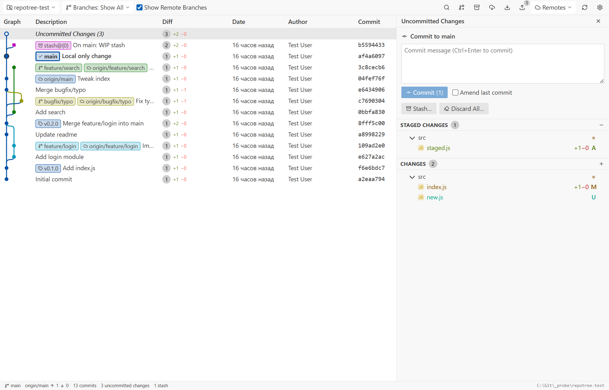

# Embegrav

**Embegrav** (Embeddable Git repo graph viewer) is a standalone Node.js server with a web UI for browsing and managing git repositories, inspired by the GitKraken, VS Code **Git Graph** extension, and Sublime Merge. Open a repository (or a folder of repositories), look at the commit graph, and run every day-to-day git operation from the UI.

<picture>
  <source media="(prefers-color-scheme: dark)" srcset="docs/screenshot-dark.png">
  <source media="(prefers-color-scheme: light)" srcset="docs/screenshot-light.png">
  
</picture>

Stack: Node.js + [Hono](https://hono.dev) server, React 19, Vite 8 (Rolldown +
Oxc), oxlint / oxfmt, Tailwind CSS 4, Lucide icons via `unplugin-icons`,
[`@pierre/diffs`](https://diffs.com) for diff rendering and
[`@pierre/trees`](https://www.npmjs.com/package/@pierre/trees) for the changed
files tree.

> The server executes git commands in your repositories and binds to
> `127.0.0.1` only. It is meant to run on your own machine; do not expose it.

## Usage

```bash
pnpm install
pnpm build            # builds the web client into dist/
pnpm start -- --open  # serves the UI for the current directory on http://127.0.0.1:3210
```

Pass one or more paths. If a path is not itself a repository, its immediate
sub-directories are scanned:

```bash
pnpm start -- C:\Git\my-repo D:\projects --port 4000 --open
# or, once linked with `pnpm link --global`:
embegrav ~/projects --open
```

During development run the API server and the Vite dev server together:

```bash
pnpm dev              # API on :3210, UI with HMR on http://localhost:5173
```

Other scripts: `pnpm lint` (oxlint), `pnpm fmt` (oxfmt), `pnpm typecheck`,
and `pnpm test` (behavioral regressions with Vitest).

Git mutation tests create disposable repositories under the operating system's
temporary directory. They do not modify the repository running the tests or
contact real remotes. UI tests exercise dialogs and asynchronous state through
jsdom; typechecking includes the test files.

## Features

- Commit graph with coloured lanes, branch / remote / tag / stash labels, HEAD
  highlighting and an "Uncommitted Changes" row. A local branch and its
  remote-tracking branch share one label (`main ⇄ origin`) while they point at
  the same commit.
- Commit table columns can be resized (double-click a divider to reset) and
  shown or hidden from the header's context menu; the details side panel
  resets its width on double-click.
- Repository switcher, branch filter dropdown, "Show Remote Branches" toggle,
  commit ordering (date / author date / topological), "Load More Commits".
- Find widget (message, author, e-mail, hash, ref names) with match stepping.
- Commit details panel: metadata, message, parents (clickable), changed files
  rendered with Pierre's file tree, per-file diff viewer (unified / split,
  syntax highlighted, expandable context) powered by Pierre diffs.
- Compare two commits with Ctrl/Cmd+click or Shift+↑/↓.
- Keyboard: ↑/↓ or j/k move between rows (open details follow the cursor),
  Enter opens details, Home/End jump to the first/last row, Ctrl/Cmd+H jumps to
  HEAD, Esc closes details.
- Uncommitted changes panel: staged / unstaged trees with inline
  stage / unstage / discard buttons on hover (Space stages or unstages the
  focused file), commit (amend pre-fills the previous message), a per-repository
  message draft and history of recent messages, 50/72 length hints, stash,
  discard all, conflict resolution helpers.
- Undo for dangerous operations: reset, drop commit, delete branch and discard
  show a notification with an Undo button (discarded changes are kept as a stash
  snapshot; resets and drops return to the previous HEAD with `reset --keep`).
- Drag a local branch label onto a commit or another branch to merge or rebase.
- Context menus:
  - Commit: create branch, checkout, cherry pick, revert, drop, merge into
    current, rebase current on, reset (soft / mixed / hard), create tag, copy.
  - Local branch: checkout, rename, delete (optionally on the remote too),
    merge, rebase, push, pull, set upstream, copy.
  - Remote branch: checkout (creates tracking branch), delete on remote,
    merge, rebase, pull into current, fetch, copy.
  - Tag: checkout, push, delete (optionally on the remote), copy.
  - Stash: apply, apply with index, pop, branch from stash, drop, copy.
- Toolbar: create branch, stash, fetch (with prune), one-click pull / push to
  the upstream (with ahead / behind badges; the arrow next to each opens the
  options dialog), remotes management (add / edit / remove), refresh,
  settings.
- Merge / rebase / cherry-pick / revert in progress banner with continue,
  skip and abort.
- Auto refresh: the server watches the `.git` directory and pushes change
  events over SSE.

## Theming with VS Code themes

Every colour in the UI is a CSS custom property named exactly like the
corresponding VS Code theme token, using the convention VS Code uses inside
webviews: `editor.background` → `--vscode-editor-background`,
`list.hoverBackground` → `--vscode-list-hoverBackground`, and so on. Tailwind
utilities are aliases on top of those variables (see `src/index.css`).

The defaults are VS Code's **Dark Modern** and **Light Modern**. Any VS Code
colour theme JSON can be imported from _Settings → Theme → Import…_:

- `colors` are applied as `--vscode-*` variables (missing keys fall back to
  the matching default theme);
- `tokenColors` are registered with Pierre's highlighter, so diffs are
  highlighted like the editor;
- the same theme drives Pierre's file tree via `themeToTreeStyles()`;
- graph lane colours are taken from the theme's terminal palette
  (`terminal.ansiBlue`, `terminal.ansiMagenta`, … then the `Bright` variants,
  see `GRAPH_COLOR_KEYS` in `src/theme/vscode.ts`).

Imported themes are persisted in `localStorage`. Programmatic use:

```ts
import { applyTheme, parseThemeJson } from './src/theme/vscode'
applyTheme(parseThemeJson(themeJsonText))
```

## Provenance

Embegrav is an independent implementation. Git Graph served as a functional
and visual reference only; no source code, text, icons or images were taken
from it. Points worth knowing when auditing the code:

- Commit metadata is read through git's public pretty-format interface
  (`%H`, `%P`, `%an`, `%ae`, `%at`, `%cn`, `%ce`, `%ct`, `%s`, `%b`). The
  parser in `server/repo.ts` is declarative: fields are named, the format
  string is generated from the requested field list, and records are parsed
  back into keyed objects, so nothing depends on field positions.
- Graph lane colours come from the VS Code terminal ANSI palette of the active
  theme; the default Dark Modern / Light Modern values are Microsoft's (MIT).
- Diff rendering and the file tree are the `@pierre/diffs` and `@pierre/trees`
  packages (Apache-2.0).

## Layout

```
server/            Hono API + git wrapper
  index.ts         CLI, routes, static serving, SSE
  git.ts           execFile wrapper, argument validation
  repo.ts          log / refs / stashes / status / diffs
  actions.ts       all mutating git operations
  repos.ts         repository registry & discovery
  watcher.ts       .git directory watcher
shared/types.ts    API types shared with the client
src/
  App.tsx          state, selection, search, shortcuts
  graph/layout.ts  lane layout algorithm
  components/      table, graph cells, details, diff viewer, menus, dialogs
  hooks/useRepoActions.tsx  context menus & git actions
  theme/           VS Code theme support
```

## API

All endpoints are under `/api` and take JSON bodies:

| Endpoint             | Purpose                                |
| -------------------- | -------------------------------------- |
| `GET /repos`         | registered repositories                |
| `POST /repos`        | register a path (`{ path }`)           |
| `POST /graph`        | commits, refs, stashes, status, state  |
| `POST /commit`       | commit details + changed files         |
| `POST /uncommitted`  | staged / unstaged files                |
| `POST /compare`      | files changed between two revisions    |
| `POST /file-diff`    | unified patch for one file             |
| `POST /file-content` | full file contents at a revision       |
| `POST /action`       | run a git action (`{ action, args }`)  |
| `GET /events`        | SSE stream of repository change events |

Action names and payloads are defined in `shared/actions.ts` and validated before
dispatch. Boolean options are JSON booleans. The API also retains options that
are not exposed by the UI: `fetch.pruneTags`, `push.forceUnsafe`, `pruneRemote`,
`rebase.ignoreDate`, and `commit.signoff`. `push.forceUnsafe` requests Git's
unconditional force push; the UI uses `force` (`--force-with-lease`).

Completing a merge with Git's prepared message uses
`{ "action": "commit", "args": { "messageMode": "prepared" } }` plus the usual
`repo` field. Ordinary commits provide `message`; `allowEmpty` controls empty
changesets, not message selection.
